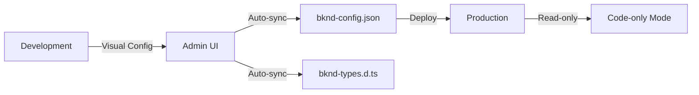

# bknd starter: Cloudflare Vite Hybrid
A fullstack React + Vite application with bknd integration, showcasing **hybrid mode** and Cloudflare Workers deployment.

## Key Features

This example demonstrates several advanced bknd features:

### 🔄 Hybrid Mode
Configure your backend **visually in development** using the Admin UI, then automatically switch to **code-only mode in production** for maximum performance. Changes made in the Admin UI are automatically synced to `bknd-config.json` and type definitions are generated in `bknd-types.d.ts`.

### 📁 Filesystem Access with Vite Plugin
Cloudflare's Vite plugin uses `unenv` which disables Node.js APIs like `fs`. This example uses bknd's `devFsVitePlugin` and `devFsWrite` to provide filesystem access during development, enabling automatic syncing of types and configuration.

### ⚡ Split Configuration Pattern
- **`config.ts`**: Shared configuration that can be safely imported in your worker
- **`bknd.config.ts`**: Wraps the configuration with `withPlatformProxy` for CLI usage with Cloudflare bindings (should NOT be imported in your worker)

This pattern prevents bundling `wrangler` into your worker while still allowing CLI access to Cloudflare resources.

## Project Structure

Inside of your project, you'll see the following folders and files:

```text
/
├── src/
│   ├── app/              # React frontend application
│   │   ├── App.tsx
│   │   ├── routes/
│   │   │   ├── admin.tsx # bknd Admin UI route
│   │   │   └── home.tsx  # Example frontend route
│   │   └── main.tsx
│   └── worker/
│       └── index.ts      # Cloudflare Worker entry
├── config.ts             # Shared bknd configuration (hybrid mode)
├── bknd.config.ts        # CLI configuration with platform proxy
├── bknd-config.json      # Auto-generated production config
├── bknd-types.d.ts       # Auto-generated TypeScript types
├── .env.example          # Auto-generated secrets template
├── vite.config.ts        # Includes devFsVitePlugin
├── package.json
└── wrangler.json         # Cloudflare Workers configuration
```

## Cloudflare resources

- **D1:** `wrangler.json` declares a `DB` binding. In production, replace `database_id` with your own (`wrangler d1 create <name>`).
- **R2:** Optional `BUCKET` binding is pre-configured to show how to add additional services.
- **Environment awareness:** `ENVIRONMENT` switch toggles hybrid behavior: production makes the database read-only, while development keeps `mode: "db"` and auto-syncs schema.
- **Static assets:** The Assets binding points to `dist/client`. Run `npm run build` before `wrangler deploy` to upload the client bundle alongside the worker.

## Admin UI & frontend

- `/admin` mounts `<Admin />` from `bknd/ui` with `withProvider={{ user }}` so it respects the authenticated user returned by `useAuth`.
- `/` showcases `useEntityQuery("todos")`, mutation helpers, and authentication state — demonstrating how the generated client types (`bknd-types.d.ts`) flow into the React code.


## Configuration Files

### `config.ts`
The main configuration file that uses the `hybrid()` mode helper:

  - Loads the generated config via an ESM `reader` (importing `./bknd-config.json`).
  - Uses `devFsWrite` as the `writer` so the CLI/plugin can persist files even though Node's `fs` API is unavailable in Miniflare.
  - Sets `typesFilePath`, `configFilePath`, and `syncSecrets` (writes `.env.example`) so config, types, and secret placeholders stay aligned.
  - Seeds example data/users in `options.seed` when the database is empty.
  - Disables the built-in admin controller because the React app renders `/admin` via `bknd/ui`.


```typescript
import { hybrid } from "bknd/modes";
import { devFsWrite, type CloudflareBkndConfig } from "bknd/adapter/cloudflare";

export default hybrid<CloudflareBkndConfig>({
   // Special reader for Cloudflare Workers (no Node.js fs)
   reader: async () => (await import("./bknd-config.json")).default,
   // devFsWrite enables file writing via Vite plugin
   writer: devFsWrite,
   // Auto-sync these files in development
   typesFilePath: "./bknd-types.d.ts",
   configFilePath: "./bknd-config.json",
   syncSecrets: {
      enabled: true,
      outFile: ".env.example",
      format: "env",
   },
   app: (env) => ({
      adminOptions: false, // Disabled - we render React app instead
      isProduction: env.ENVIRONMENT === "production",
      secrets: env,
      // ... your configuration
   }),
});
```

### `bknd.config.ts`
Wraps the configuration for CLI usage with Cloudflare bindings:

```typescript
import { withPlatformProxy } from "bknd/adapter/cloudflare/proxy";
import config from "./config.ts";

export default withPlatformProxy(config);
```

### `vite.config.ts`
Includes the `devFsVitePlugin` for filesystem access:

```typescript
import { devFsVitePlugin } from "bknd/adapter/cloudflare";

export default defineConfig({
   plugins: [
      // ...
      devFsVitePlugin({ configFile: "config.ts" }),
      cloudflare(),
   ],
});
```

## Commands

All commands are run from the root of the project, from a terminal:

| Command            | Action                                                    |
|:-------------------|:----------------------------------------------------------|
| `npm install`      | Installs dependencies and generates wrangler types        |
| `npm run dev`      | Starts local dev server with Vite at `localhost:5173`     |
| `npm run build`    | Builds the application for production                     |
| `npm run preview`  | Builds and previews the production build locally          |
| `npm run deploy`   | Builds, syncs the schema and deploys to Cloudflare Workers|
| `npm run bknd`     | Runs bknd CLI commands                                    |
| `npm run bknd:types` | Generates TypeScript types from your schema             |
| `npm run cf:types` | Generates Cloudflare Worker types from `wrangler.json`    |
| `npm run check`    | Type checks and does a dry-run deployment                 |

## Development Workflow

1. **Install dependencies:**
   ```sh
   npm install
   ```

2. **Start development server:**
   ```sh
   npm run dev
   ```

3. **Visit the Admin UI** at `http://localhost:5173/admin` to configure your backend visually:
   - Create entities and fields
   - Configure authentication
   - Set up relationships
   - Define permissions

4. **Watch for auto-generated files:**
   - `bknd-config.json` - Production configuration
   - `bknd-types.d.ts` - TypeScript types
   - `.env.example` - Required secrets

5. **Use the CLI** for manual operations:
   ```sh
   # Generate types manually
   npm run bknd:types
   
   # Sync the production database schema (only safe operations are applied)
   CLOUDFLARE_ENV=production npm run bknd -- sync --force
   ```

## Before you deploy

If you're using a D1 database, make sure to create a database in your Cloudflare account and replace the `database_id` accordingly in `wrangler.json`:

```sh
npx wrangler d1 create my-database
```

Update `wrangler.json`:
```json
{
   "d1_databases": [
      {
         "binding": "DB",
         "database_name": "my-database",
         "database_id": "your-database-id-here"
      }
   ]
}
```

## Deployment

Deploy to Cloudflare Workers:

```sh
npm run deploy
```

This will:
1. Set `ENVIRONMENT=production` to activate code-only mode
2. Build the Vite application
3. Deploy to Cloudflare Workers using Wrangler

In production, bknd will:
- Use the configuration from `bknd-config.json` (read-only)
- Skip config validation for better performance
- Expect secrets to be provided via environment variables

## Environment Variables

Make sure to set your secrets in the Cloudflare Workers dashboard or via Wrangler:

```sh
# Example: Set JWT secret
npx wrangler secret put auth.jwt.secret
```

Check `.env.example` for all required secrets after running the app in development mode.

## How Hybrid Mode Works



1. **In Development:** `mode: "db"` - Configuration stored in database, editable via Admin UI
2. **Auto-sync:** Changes automatically written to `bknd-config.json` and types to `bknd-types.d.ts`
3. **In Production:** `mode: "code"` - Configuration read from `bknd-config.json`, no database overhead

## Why devFsVitePlugin?

Cloudflare's Vite plugin removes Node.js APIs for Workers compatibility. This breaks filesystem operations needed for:
- Auto-syncing TypeScript types (`syncTypes` plugin)
- Auto-syncing configuration (`syncConfig` plugin)
- Auto-syncing secrets (`syncSecrets` plugin)

The `devFsVitePlugin` + `devFsWrite` combination provides a workaround by using Vite's module system to enable file writes during development.

## Want to learn more?

- [Cloudflare Integration Documentation](https://docs.bknd.io/integration/cloudflare)
- [Hybrid Mode Guide](https://docs.bknd.io/usage/introduction#hybrid-mode)
- [Mode Helpers Documentation](https://docs.bknd.io/usage/introduction#mode-helpers)
- [Discord Community](https://discord.gg/952SFk8Tb8)

